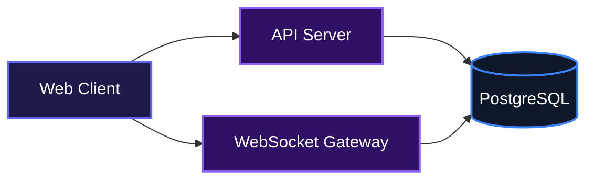
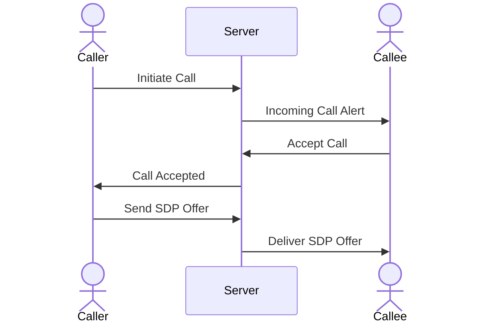
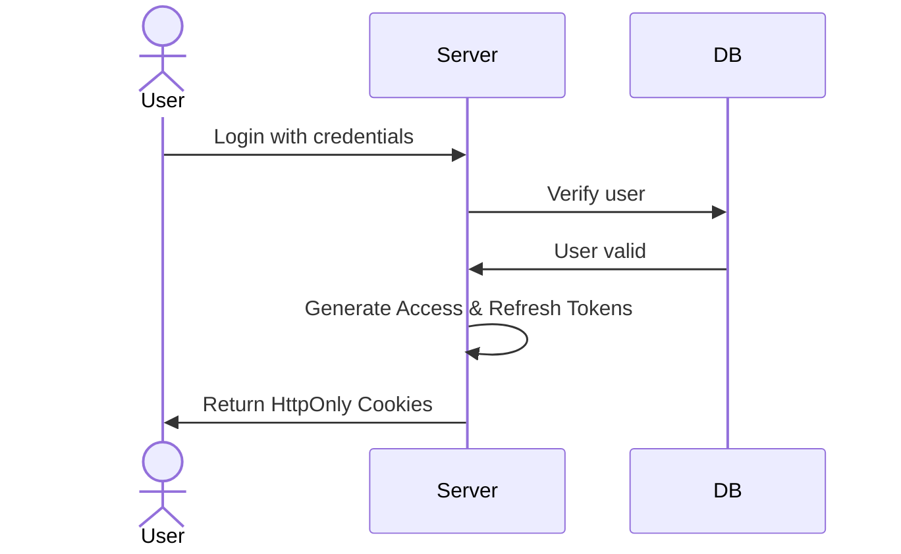

# Huddle Backend

Huddle is a real-time communication backend built for chat and audio/video
calling applications.

It provides the server-side infrastructure for authentication, user
management, conversations, messaging, real-time communication, and WebRTC
call signaling.

The backend exposes a REST API for request-response operations and a
Socket.IO gateway for real-time events and call signaling..

## System Architecture



## Features

- **Real-Time Messaging**: Support for direct messages and group conversations with instant delivery.
- **WebRTC Call Signaling**: Built-in signaling for audio and video calls, managing offers, answers, and ICE candidates.



- **Advanced Chat Functions**: Features message reactions, mentions, and read receipts across all active clients.
- **Secure Authentication**: Handles user registration, local login, and Google OAuth with secure, HttpOnly cookie-based JWT sessions.



## Installation

Clone the Repository:

```bash
git clone <repository-url>
```

Navigate to the project directory and install dependencies:

```bash
cd huddle
npm install
```

Set up your database schemas:

```bash
npm run db:generate
npm run db:migrate
npm run db:push
```

## Usage

Create a `.env` file in the root of the project and define your environment variables.

Start the development server:

```bash
npm run dev
```

For production environments, build the project and run the output:

```bash
npm run build
npm start
```

## Environment Variables

Create a `.env` file and populate it with the following configuration keys:

- `PORT`: The port on which the server will run (default is 8080).
- `NODE_ENV`: Set to `development` or `production`.
- `DATABASE_URL`: Your PostgreSQL connection string.
- `FRONTEND_URL`: The URL of your frontend application to allow CORS.
- `JWT_ACCESS_SECRET`: Secret key for signing access tokens.

## API Documentation

### Auth Routes

#### POST /api/v1/auth/register

**Description**: Registers a new user and returns authentication cookies.

**Request**:

```json
{
  "email": "user@example.com",
  "password": "securepassword123",
  "username": "johndoe",
  "firstName": "John",
  "lastName": "Doe"
}
```

**Response**:

```json
{
  "success": true,
  "data": {
    "id": "uuid-string",
    "email": "user@example.com",
    "username": "johndoe",
    "avataUrl": null
  },
  "message": null
}
```

**Errors**:

- 400: Validation errors (e.g., password too short, invalid email).
- 409: Registration failed due to conflicting email or username.

#### POST /api/v1/auth/login

**Description**: Authenticates a user and sets HttpOnly cookies for sessions.

**Request**:

```json
{
  "identifier": "user@example.com",
  "password": "securepassword123"
}
```

**Response**:

```json
{
  "success": true,
  "data": {
    "id": "uuid-string",
    "email": "user@example.com",
    "username": "johndoe",
    "avataUrl": null
  },
  "message": null
}
```

**Errors**:

- 401: Unauthorized (incorrect credentials).

#### POST /api/v1/auth/logout

**Description**: Revokes the refresh token and clears session cookies.

**Request**: Empty body.

**Response**:

```json
{
  "success": true,
  "data": null,
  "message": null
}
```

**Errors**:

- 400: Refresh token not found.

#### GET /api/v1/auth/google

**Description**: Initiates the Google OAuth login flow.

**Response**: Redirects to the Google consent screen.

#### GET /api/v1/auth/google/callback

**Description**: Callback URL for Google OAuth to finalize authentication.

**Response**: Redirects to the frontend chat application.

**Errors**:

- 401: Unauthorized if Google authentication fails.

#### POST /api/v1/auth/refresh

**Description**: Refreshes an expired access token using the stored refresh token cookie.

**Request**: Empty body.

**Response**:

```json
{
  "success": true,
  "data": null,
  "message": null
}
```

**Errors**:

- 400: Refresh token not found.
- 401: Invalid or expired refresh token.

### User Routes

#### GET /api/v1/user/me

**Description**: Retrieves the currently authenticated user's profile.

**Request**: Empty body.

**Response**:

```json
{
  "success": true,
  "data": {
    "id": "uuid-string",
    "email": "user@example.com",
    "username": "johndoe",
    "displayName": "John Doe",
    "avatarUrl": null,
    "bio": null,
    "globalRole": "user",
    "isEmailVerified": false
  },
  "message": null
}
```

**Errors**:

- 401: Unauthorized.

#### GET /api/v1/user/search

**Description**: Searches for users by username.

**Request**: Query parameter `?username=searchterm`

**Response**:

```json
{
  "success": true,
  "data": [
    {
      "id": "uuid-string",
      "username": "searchterm",
      "displayName": "Search User",
      "avatarUrl": "url",
      "bio": "Hello"
    }
  ],
  "message": null
}
```

**Errors**:

- 401: Unauthorized.

#### GET /api/v1/user/:username

**Description**: Retrieves a specific user's public profile by their username.

**Request**: Empty body.

**Response**:

```json
{
  "success": true,
  "data": {
    "id": "uuid-string",
    "username": "targetuser",
    "displayName": "Target User",
    "avatarUrl": "url",
    "bio": "Bio content"
  },
  "message": null
}
```

**Errors**:

- 404: User not found.

#### GET /api/v1/user/me/pending-invites

**Description**: Fetches all pending group invitations for the current user.

**Request**: Empty body.

**Response**:

```json
{
  "success": true,
  "data": {
    "result": 1,
    "invites": [
      {
        "id": "invite-uuid",
        "kind": "invite",
        "conversationId": "convo-uuid",
        "fromUser": "inviter-uuid",
        "conversationName": "Cool Group",
        "conversationAvatar": null,
        "createdAt": "2023-01-01T00:00:00.000Z"
      }
    ]
  },
  "message": null
}
```

**Errors**:

- 401: Unauthorized.

### Conversation Routes

#### GET /api/v1/conversation

**Description**: Retrieves all conversations the current user is a participant in.

**Request**: Empty body.

**Response**:

```json
{
  "success": true,
  "data": [
    {
      "id": "convo-uuid",
      "type": "direct",
      "name": "Jane Doe",
      "avatar": "url",
      "otherUserId": "jane-uuid",
      "membersCount": null,
      "updatedAt": "2023-01-01T00:00:00.000Z"
    }
  ],
  "message": null
}
```

#### POST /api/v1/conversation/ping

**Description**: Initiates a direct conversation (ping) with another user.

**Request**:

```json
{
  "id": "target-user-uuid"
}
```

**Response**:

```json
{
  "success": true,
  "data": {
    "id": "convo-uuid",
    "type": "direct",
    "visibility": "private",
    "pingStatus": "pending"
  },
  "message": null
}
```

**Errors**:

- 400: Cannot start a conversation with yourself.

#### POST /api/v1/conversation/pings/:id/accept

**Description**: Accepts an incoming direct conversation request.

**Request**: Empty body.

**Response**:

```json
{
  "success": true,
  "data": {
    "message": "Ping accepted"
  },
  "message": null
}
```

**Errors**:

- 400: No pending request or trying to accept your own ping.

#### POST /api/v1/conversation/pings/:id/decline

**Description**: Declines an incoming direct conversation request.

**Request**: Empty body.

**Response**:

```json
{
  "success": true,
  "data": {
    "message": "Ping declined"
  },
  "message": null
}
```

#### POST /api/v1/conversation/groups

**Description**: Creates a new group conversation with specified participants.

**Request**:

```json
{
  "name": "Project Team",
  "description": "Discussion for the new project",
  "visibility": "private",
  "participantIds": ["user-uuid-1", "user-uuid-2"]
}
```

**Response**:

```json
{
  "success": true,
  "data": {
    "id": "convo-uuid",
    "type": "group",
    "name": "Project Team",
    "visibility": "private"
  },
  "message": null
}
```

**Errors**:

- 400: Requires at least two participants or validation failed.
- 403: Cannot invite yourself.

#### PATCH /api/v1/conversation/invites/:requestId

**Description**: Accepts or declines a pending group invitation (called by the invitee).

**Request**:

```json
{
  "decision": "accept"
}
```

**Response**:

```json
{
  "success": true,
  "data": {
    "status": "accepted",
    "conversationId": "convo-uuid"
  },
  "message": null
}
```

**Errors**:

- 403: Not your invite.
- 409: Request already resolved.

#### PATCH /api/v1/conversation/:conversationId

**Description**: Updates group conversation details. Requires admin permissions.

**Request**:

```json
{
  "name": "Updated Team Name",
  "description": "Updated description"
}
```

**Response**:

```json
{
  "success": true,
  "data": {
    "message": "Conversation updated successfully",
    "updatedConversation": {}
  },
  "message": null
}
```

**Errors**:

- 403: Not authorized to manage this group.

#### PATCH /api/v1/conversation/join-requests/:requestId

**Description**: Resolves a user's request to join a private group. Requires admin permissions.

**Request**:

```json
{
  "decision": "approve"
}
```

**Response**:

```json
{
  "success": true,
  "data": {
    "status": "accepted",
    "conversationId": "convo-uuid"
  },
  "message": null
}
```

#### PATCH /api/v1/conversation/:conversationId/invite-code

**Description**: Generates a new invite code for a conversation. Requires admin permissions.

**Request**: Empty body.

**Response**:

```json
{
  "success": true,
  "data": {
    "inviteCode": "generatedcode",
    "invitelink": "https://frontend.com/invite/generatedcode"
  },
  "message": null
}
```

#### GET /api/v1/conversation/invites/:inviteCode

**Description**: Retrieves conversation details associated with a specific invite code.

**Request**: Empty body.

**Response**:

```json
{
  "success": true,
  "data": {
    "id": "convo-uuid",
    "name": "Public Group",
    "membersCount": 5
  },
  "message": null
}
```

#### POST /api/v1/conversation/invites/:inviteCode

**Description**: Joins a group using an invite code.

**Request**: Empty body.

**Response**:

```json
{
  "success": true,
  "data": "Request sent successfully and waiting for admin approval",
  "message": null
}
```

#### POST /api/v1/conversation/invites

**Description**: Invites a specific user to a group. Requires admin permissions.

**Request**:

```json
{
  "conversationId": "convo-uuid",
  "userId": "target-user-uuid"
}
```

**Response**:

```json
{
  "success": true,
  "data": {
    "message": "User invited successfully"
  },
  "message": null
}
```

#### GET /api/v1/conversation/:conversationId/requests

**Description**: Lists all pending join requests for a group. Requires admin permissions.

**Request**: Empty body.

**Response**:

```json
{
  "success": true,
  "data": {
    "result": 1,
    "requests": [
      {
        "id": "request-uuid",
        "kind": "request",
        "userId": "user-uuid",
        "username": "johndoe"
      }
    ]
  },
  "message": null
}
```

#### GET /api/v1/conversation/:conversationId/messages

**Description**: Retrieves the message timeline for a conversation.

**Request**: Query parameters `?limit=50&before=timestamp`

**Response**:

```json
{
  "success": true,
  "data": [
    {
      "type": "message",
      "createdAt": "2023-01-01T00:00:00.000Z",
      "data": {
        "id": "msg-uuid",
        "body": "Hello world"
      }
    }
  ],
  "message": null
}
```

#### PATCH /api/v1/conversation/:conversationId/participants/:userId/role

**Description**: Updates a participant's role (admin/member). Requires admin permissions.

**Request**:

```json
{
  "role": "admin"
}
```

**Response**:

```json
{
  "success": true,
  "data": "New Admin added successfully",
  "message": null
}
```

#### DELETE /api/v1/conversation/:conversationId/participants/me

**Description**: Leaves a conversation.

**Request**: Empty body.

**Response**:

```json
{
  "success": true,
  "data": "User left the group successfully",
  "message": null
}
```

#### DELETE /api/v1/conversation/:conversationId/participants/:userId

**Description**: Removes a member from a conversation. Requires admin permissions.

**Request**: Empty body.

**Response**:

```json
{
  "success": true,
  "data": {
    "message": "Member removed successfully"
  },
  "message": null
}
```

#### DELETE /api/v1/conversation/:conversationId

**Description**: Deletes a conversation entirely. Only the creator can perform this action.

**Request**: Empty body.

**Response**:

```json
{
  "success": true,
  "data": {
    "message": "Conversation deleted successfully"
  },
  "message": null
}
```

### Message Routes

#### POST /api/v1/message

**Description**: Creates a new message in a conversation.

**Request**:

```json
{
  "conversationId": "convo-uuid",
  "content": "Hello team!"
}
```

**Response**:

```json
{
  "success": true,
  "data": {
    "id": "msg-uuid",
    "conversationId": "convo-uuid",
    "senderId": "user-uuid",
    "body": "Hello team!",
    "createdAt": "2023-01-01T00:00:00.000Z"
  },
  "message": null
}
```

#### GET /api/v1/message/conversation/:conversationId

**Description**: Fetches standard messages by conversation ID.

**Request**: Empty body.

**Response**:

```json
{
  "success": true,
  "data": [
    {
      "id": "msg-uuid",
      "body": "Hello team!",
      "createdAt": "2023-01-01T00:00:00.000Z"
    }
  ],
  "message": null
}
```

#### GET /api/v1/message/:messageId

**Description**: Fetches a single message by its ID.

**Request**: Empty body.

**Response**:

```json
{
  "success": true,
  "data": {
    "id": "msg-uuid",
    "body": "Hello team!"
  },
  "message": null
}
```

#### PUT /api/v1/message/:messageId

**Description**: Edits an existing message. The user must be the sender.

**Request**:

```json
{
  "content": "Edited message content"
}
```

**Response**:

```json
{
  "success": true,
  "data": {
    "id": "msg-uuid",
    "body": "Edited message content",
    "editedAt": "2023-01-01T00:05:00.000Z"
  },
  "message": null
}
```

#### DELETE /api/v1/message/:messageId

**Description**: Deletes a message.

**Request**: Empty body.

**Response**: Returns 204 No Content.

## Contributing

We welcome community contributions. To contribute, fork the repository, make your desired changes, and submit a pull request for review. Please make sure your code adheres to standard styling rules and includes relevant tests for new features.

## Author Info

- LinkedIn: https://linkedin.com/in/obed-smart
- X (Twitter): https://x.com/eberechukwuobed

## Technologies Used

| Category  | Technologies                                                                                                                                                                                                                                                                           |
| --------- | -------------------------------------------------------------------------------------------------------------------------------------------------------------------------------------------------------------------------------------------------------------------------------------- |
| Languages | [](https://www.typescriptlang.org/) [](https://nodejs.org/) |
| Backend   | [](https://expressjs.com/) [](https://socket.io/)           |
| Database  | [](https://www.postgresql.org/) [](https://orm.drizzle.team/) |
| Security  | [](https://www.passportjs.org/) [](https://zod.dev/)                            |

[](https://dokugen.samueltuoyo.com)
